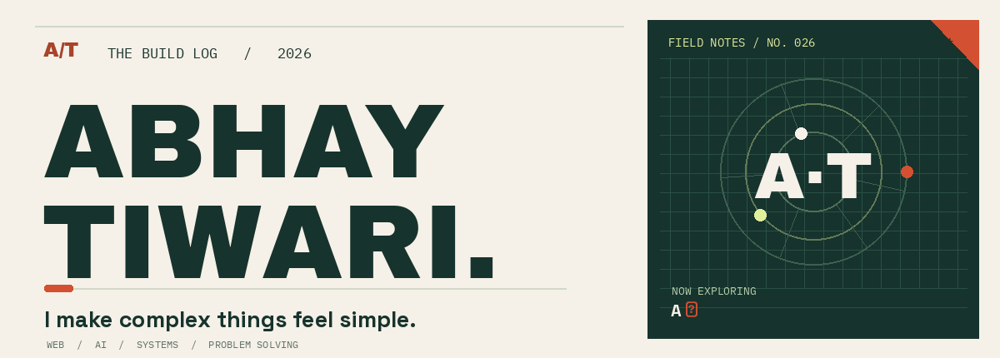
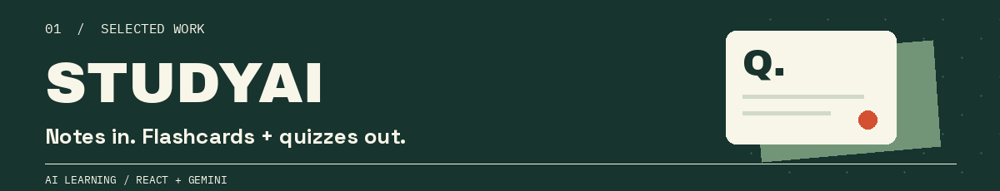
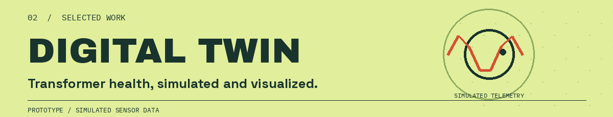
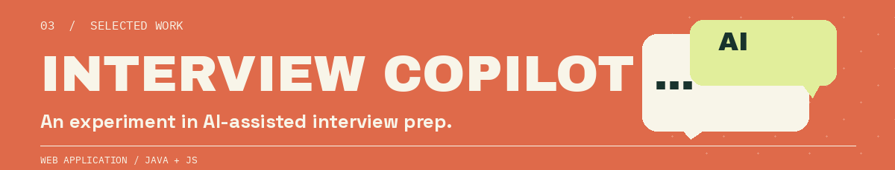
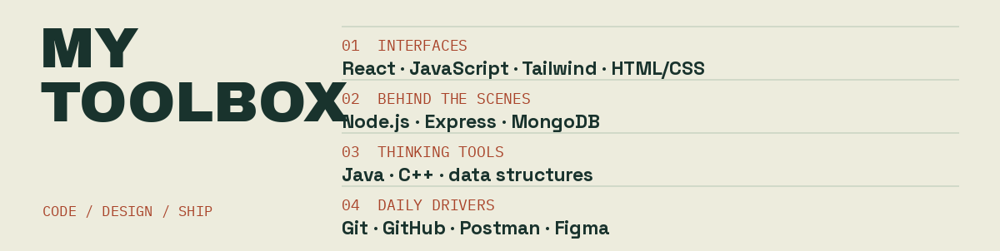
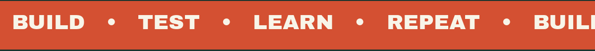
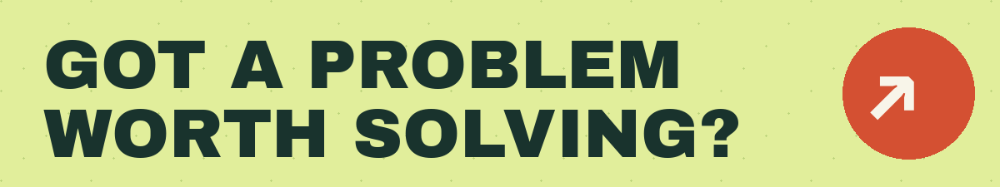

<!-- The animations are real GIFs stored in /assets. GitHub README pages do not run JavaScript. -->
<p align="center">
  <picture>
    <source media="(prefers-reduced-motion: reduce) and (max-width: 600px)" srcset="./assets/hero-mobile-still.png">
    <source media="(prefers-reduced-motion: reduce)" srcset="./assets/hero-still.png">
    <source media="(max-width: 600px)" srcset="./assets/hero-mobile.gif">
    
  </picture>
</p>

<p align="center">
  
  
</p>

<p align="center">
  <a href="https://github.com/AbhayTiwari26?tab=repositories">EXPLORE THE CODE ↗</a> &nbsp;•&nbsp;
  <a href="https://bebetterportfolio.vercel.app/">SEE THE PORTFOLIO ↗</a> &nbsp;•&nbsp;
  <a href="mailto:2k23.cs2314007@gmail.com">SAY HELLO ↗</a>
</p>

## 00 / The person behind the pixels

I'm **Abhay**, a computer science student in Kanpur who likes the whole journey: spotting a real problem, shaping the interface, building what's behind it, and shipping something useful. Lately, that means **full-stack apps**, **AI-powered learning tools**, and a lot of **Java + DSA**.

> Every complex problem has a simple, elegant solution. The fun part is finding it.

## 01 / Things I've built

<a href="https://github.com/AbhayTiwari26/ai-study-assistant">
  <picture>
    <source media="(max-width: 600px)" srcset="./assets/studyai-mobile.png">
    
  </picture>
</a>

**[StudyAI](https://github.com/AbhayTiwari26/ai-study-assistant)** turns notes into interactive flashcards and quizzes, with answer review and saved progress. Built with React 19, Express, Tailwind and Gemini. **[Try it live ↗](https://ai-study-assistant-kappa-black.vercel.app/)**

<br>

<a href="https://github.com/AbhayTiwari26/digital_twin_prototype">
  <picture>
    <source media="(max-width: 600px)" srcset="./assets/digital-twin-mobile.png">
    
  </picture>
</a>

**[Transformer Digital Twin](https://github.com/AbhayTiwari26/digital_twin_prototype)** explores how a monitoring dashboard could visualize transformer health. Voltage, temperature, oil level and vibration are **simulated**, not live field readings. **[Explore the prototype ↗](https://digital-twin-prototype.vercel.app/)**

<br>

<a href="https://github.com/AbhayTiwari26/ai-job-interview-copilot">
  <picture>
    <source media="(max-width: 600px)" srcset="./assets/interview-copilot-mobile.png">
    
  </picture>
</a>

**[AI Interview Copilot](https://github.com/AbhayTiwari26/ai-job-interview-copilot)** is an experiment in AI-assisted interview prep, with Java and JavaScript in the codebase. **[Open the app ↗](https://ai-job-interview-copilot.vercel.app/)** (starts at sign-in).

**Also on my bench:** my [React + TypeScript portfolio](https://github.com/AbhayTiwari26/portfolio), with a [live version here ↗](https://bebetterportfolio.vercel.app/).

## 02 / My toolbox

<picture>
  <source media="(max-width: 600px)" srcset="./assets/toolbox-mobile.png">
  
</picture>

<p align="center">
  <picture>
    <source media="(prefers-reduced-motion: reduce) and (max-width: 600px)" srcset="./assets/build-tape-mobile-still.png">
    <source media="(prefers-reduced-motion: reduce)" srcset="./assets/build-tape-still.png">
    <source media="(max-width: 600px)" srcset="./assets/build-tape-mobile.gif">
    
  </picture>
</p>

## 03 / What I'm working toward

```text
CURRENT COORDINATES
──────────────────────────────────────────
BUILD    →  useful full-stack products
LEARN    →  system design + cloud computing
PRACTICE →  Java, C++ and problem solving
```

My default approach: **make it understandable, make it work, then make it better.**

<details>
  <summary><strong>What's under the hood?</strong></summary>
  <br>
  I like the overlap between thoughtful front ends and solid back ends. StudyAI is where AI meets hands-on learning; the digital twin is where data becomes a visual story. I'm always interested in feedback, especially the kind that makes a project more useful.
</details>

## 04 / The problem-solving side

DSA keeps my fundamentals honest. Find me on **[LeetCode](https://leetcode.com/u/coder_Abhay07/)** and **[HackerRank](https://www.hackerrank.com/profile/2K23_cs2314007)**.

<details>
  <summary><strong>Open the live LeetCode card ↗</strong></summary>
  <br>
  <a href="https://leetcode.com/u/coder_Abhay07/">
    
  </a>
</details>

## 05 / Make the next thing together

<p align="center">
  <picture>
    <source media="(max-width: 600px)" srcset="./assets/footer-mobile.png">
    
  </picture>
</p>

<p align="center">
  <a href="mailto:2k23.cs2314007@gmail.com"><strong>EMAIL ME ↗</strong></a> &nbsp;•&nbsp;
  <a href="https://www.linkedin.com/in/abhay-tiwari-2a3b74307/"><strong>LINKEDIN ↗</strong></a> &nbsp;•&nbsp;
  <a href="https://github.com/AbhayTiwari26?tab=repositories"><strong>MORE PROJECTS ↗</strong></a>
</p>
