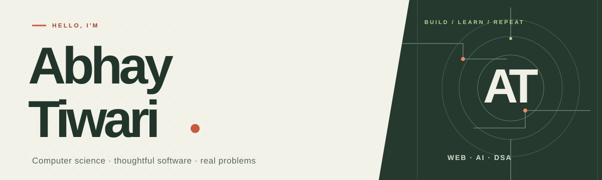

  <picture>
    <source media="(max-width: 600px)" srcset="./assets/abhay-cover-mobile.svg">
    
  </picture>

  <a href="https://github.com/AbhayTiwari26?tab=repositories">Projects</a> &nbsp;·&nbsp;
  <a href="https://www.linkedin.com/in/abhay-tiwari-2a3b74307/">LinkedIn</a> &nbsp;·&nbsp;
  <a href="mailto:2k23.cs2314007@gmail.com">Email me</a>

## Hey, I'm Abhay 👋

I'm a computer science student who likes turning complicated problems into useful, straightforward software. I build web apps, experiment with AI, and sharpen my fundamentals with Java, C++, and DSA.

> Every complex problem has a simple, elegant solution.

## Selected builds

### 01 / [StudyAI](https://github.com/AbhayTiwari26/ai-study-assistant)

Turn notes into interactive flashcards and quizzes. Built with React, Express, and Google Gemini. **[Try the live app ↗](https://ai-study-assistant-kappa-black.vercel.app/)**

### 02 / [Transformer Digital Twin](https://github.com/AbhayTiwari26/digital_twin_prototype)

A prototype for monitoring transformer health with simulated sensor readings, visualizations, and fault alerts. **[Explore the demo ↗](https://digital-twin-prototype.vercel.app/)**

### 03 / [AI Interview Copilot](https://github.com/AbhayTiwari26/ai-job-interview-copilot)

A Java and JavaScript project exploring AI-assisted interview preparation. **[Open the app ↗](https://ai-job-interview-copilot.vercel.app/)**

## In the workshop

- **Building:** full-stack applications with React, Node.js, Express, and MongoDB.
- **Learning:** system design and cloud computing.
- **Practicing:** data structures and algorithms in Java and C++.

## Tools I reach for

| Area | Toolkit |
|:--|:--|
| **Languages** | Java · C++ · JavaScript |
| **Front end** | HTML · CSS · React · Tailwind CSS |
| **Back end & data** | Node.js · Express · MongoDB |
| **Workflow** | Git · GitHub · Postman · Figma |

## Beyond the repo

Problem-solving is a habit. Find me on [LeetCode](https://leetcode.com/u/coder_Abhay07/) and [HackerRank](https://www.hackerrank.com/profile/2K23_cs2314007).

---

  <strong>Have a problem worth solving?</strong> 
  <a href="mailto:2k23.cs2314007@gmail.com">Let's talk</a> · <a href="https://github.com/AbhayTiwari26?tab=repositories">Explore more projects</a>

